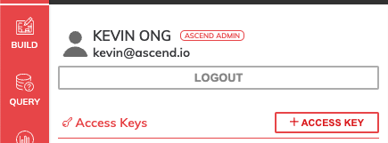
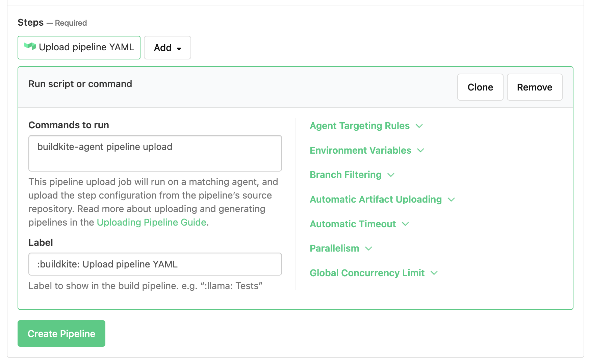

# Ascend CICD for Dataflows

Setup script to generate Ascend pipeline. 

## Pre-requisites

* Make sure you have a [buildkite account](https://buildkite.com/).
* Make sure you have a [github](https://github.com/)/[bitbucket](https://id.atlassian.com/login?application=bitbucket) account.
* Make sure you have an active [buildkite-agent](https://buildkite.com/docs/agent/v3) to store your secrets.


## Setup guide

```
$ python3 -m venv venv/
$ source venv/bin/activate
$ pip3 install -r requirements.txt
```

Obtain your access and secret keys from your Ascend environment as it is required in the next step.
It can be found from your Profile tab:



```
$ python3 init.py
```

Once that is completed, your Ascend dataflow will be downloaded locally. 
You can now create a new remote repo on github/bitbucket and create a webhook for buildkite.
```
$ git remote rm origin
$ git remote add origin YOUR_NEW_REPO
$ git commit -am 'initial commit'
$ git push
```

Create a new pipeline: [](https://buildkite.com/new)

For build steps command, you can use `buildkite-agent pipeline upload`, which will deploy according to `.buildkite/pipeline.yml` instructions.




### Adding credentials

Add your credentials for access key as `ASCEND_ACCESS_KEY_ID` and secret key as `ASCEND_SECRET_ACCESS_KEY` to your buildkite agent. 

In order to allow your buildkite agent to download from your git repository, you need to create your ssh keys as your buildkite-agent:
```
$ sudo su buildkite-agent # or whichever user your agent runs as
$ mkdir -p ~/.ssh && cd ~/.ssh
$ ssh-keygen -t rsa -b 4096 -C "dev+build@myorg.com"
```

Further instructions for creating or maintaining multiple ssh keys can be found here: [link](https://buildkite.com/docs/agent/v3/ssh-keys)
